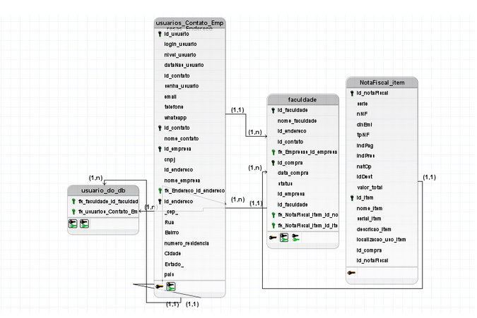

# Projeto Conceitual SQL Avançado
  ## Este projeto contempla um SGBD simples porem usual, parte do projeto do 3Periodo em SPI.
### Exemplificação ... 

## BRModelo Conceitual.
</img>

## BRModelo Lógico.
</img>

